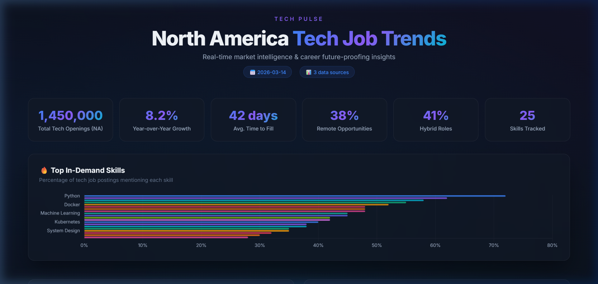

<div align="center">

# 🔮 Tech Pulse

**On-demand tech job trends agent for North America**

Track the hottest skills, fastest-growing roles, salary benchmarks, and get personalized career future-proofing insights — all rendered in a stunning interactive dashboard.

[](https://python.org)
[](LICENSE)
[](https://www.chartjs.org)

</div>

---

<div align="center">

</div>

## ✨ Features

| Feature | Description |
|---------|-------------|
| 🔥 **Skill Demand Rankings** | Top 25 in-demand skills ranked by % of job postings |
| 💼 **Role Demand Analysis** | 15 tech roles ranked by open positions with YoY growth |
| 💰 **Salary Benchmarks** | Average salaries by role across North America |
| 📍 **Location Intelligence** | Job distribution across 16 major tech hubs |
| 🚀 **Growth Radar** | Fastest-growing skills with YoY momentum |
| 🎯 **Demand vs Growth Chart** | Radar visualization of category potential |
| ⚡ **Short-Term Insights** | What to learn in the next 6-12 months |
| 🔮 **Long-Term Strategy** | Where to invest for the next 2-5 years |
| 🗺️ **Career Paths** | 5 strategic progression routes with salary ranges |
| 🌊 **Emerging Trends** | 10 frontier technologies with maturity stages |

## 🚀 Quick Start

```bash
# Clone the repo
git clone https://github.com/lazylutera/tech-pulse.git
cd tech-pulse

# Set up virtual environment
python -m venv venv

# Activate (Windows)
.\venv\Scripts\activate
# Activate (macOS/Linux)
source venv/bin/activate

# Install dependencies
pip install -r requirements.txt

# Run the agent
python main.py --no-api
```

The dashboard opens automatically in your browser. That's it! 🎉

## 📖 Usage

```bash
# Full run — collect data + analyze + generate dashboard
python main.py --no-api

# With live job data (requires free SerpApi key)
set SERPAPI_KEY=your_key_here   # Windows
export SERPAPI_KEY=your_key     # macOS/Linux
python main.py

# Regenerate dashboard from cached data
python main.py --dashboard-only

# Collect data only (no dashboard)
python main.py --collect-only

# Don't auto-open browser
python main.py --no-api --no-browser
```

## 🏗️ Architecture

```
tech-pulse/
├── main.py              # CLI entry point (argparse)
├── config.py            # Roles, skills, locations, API config
├── collector.py         # SerpApi + web scraping + curated intelligence
├── analytics.py         # Skill/role/location/salary processing
├── insights.py          # Career insights engine (short & long term)
├── dashboard.py         # Jinja2 HTML dashboard generator
├── requirements.txt     # Python dependencies
├── templates/
│   └── dashboard.html   # Dark-mode glassmorphism template
├── data/
│   ├── raw/             # Timestamped raw collection JSON
│   └── processed/       # Processed analytics JSON
└── output/
    └── dashboard.html   # Generated interactive dashboard
```

### Data Pipeline

```
Collection → Analysis → Insights → Dashboard
    │            │          │          │
    ├─ SerpApi   ├─ Skills  ├─ Short   ├─ Chart.js
    ├─ Scraping  ├─ Roles   │  Term    ├─ Glass UI
    └─ Curated   ├─ Salary  ├─ Long    └─ HTML file
       Data      └─ Geo     │  Term
                             └─ Career
                                Paths
```

## 📊 Data Sources

| Source | Type | Requires API Key |
|--------|------|:---:|
| **Curated Market Intelligence** (BLS, LinkedIn, Dice, Gartner) | Always available | ❌ |
| **SerpApi** (Google Jobs) | Live job postings | ✅ Free tier: 100/mo |
| **Indeed Hiring Lab** | Market trends | ❌ |
| **GitHub Octoverse** | Developer ecosystem | ❌ |
| **TIOBE Index** | Language rankings | ❌ |

> **Works fully without any API key.** The curated market intelligence dataset provides comprehensive coverage. SerpApi enriches the data with live job postings when available.

## 🔑 SerpApi Setup (Optional)

1. Sign up at [serpapi.com](https://serpapi.com) (free tier: 100 searches/month)
2. Set the environment variable:
   ```bash
   # Windows
   set SERPAPI_KEY=your_key_here
   # macOS/Linux
   export SERPAPI_KEY=your_key_here
   ```
3. Run without `--no-api` flag:
   ```bash
   python main.py
   ```

## 🤝 Contributing

Contributions are welcome! Here are some ideas:

- 🌍 Add more geographic regions (Europe, Asia-Pacific)
- 📈 Integrate additional job board APIs
- 🤖 Add AI-powered trend forecasting
- 📧 Add email report generation
- 🔄 Add scheduling for automated periodic runs
- 📱 Build a companion mobile-friendly view

## 📄 License

This project is licensed under the MIT License — see [LICENSE](LICENSE) for details.

---

<div align="center">

**Built with ❤️ for the tech community**

If this helped you, consider giving it a ⭐

</div>
